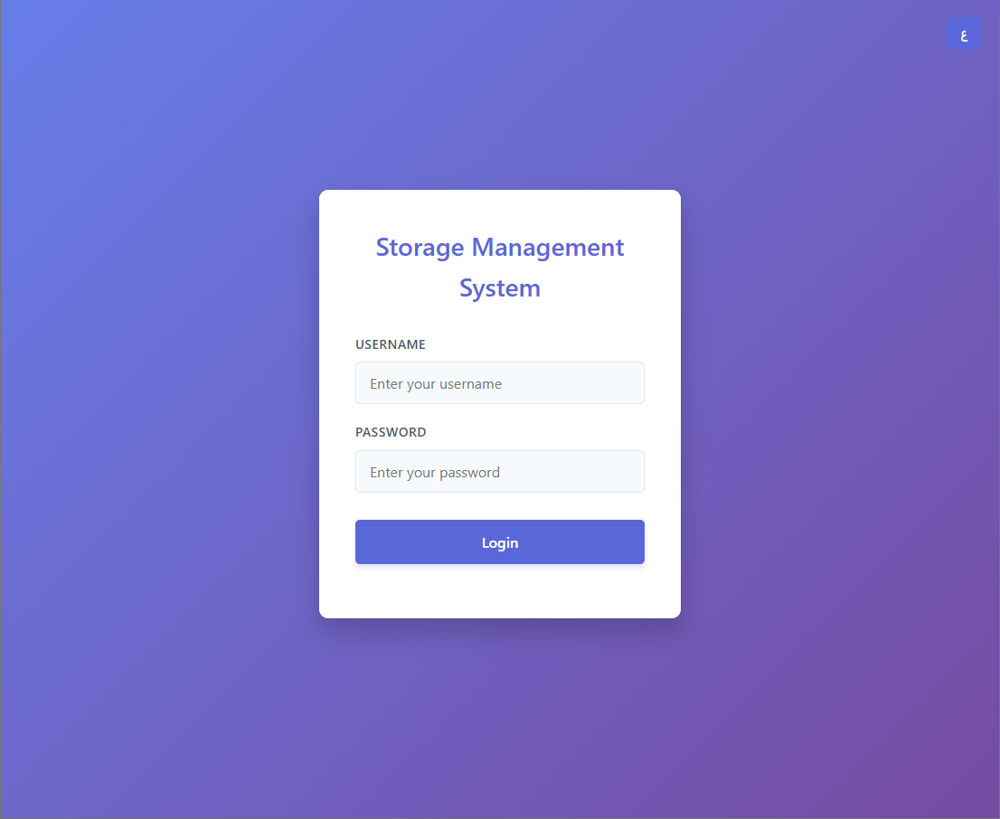
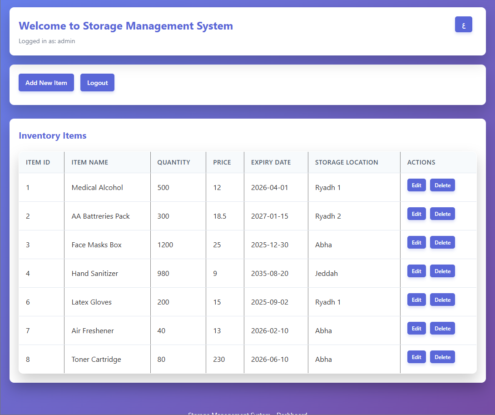

# Storage Management System Website

A bilingual (Arabic/English) responsive web application for managing storage operations. Designed as part of a Web Engineering course project.

## Features

- 📦 Manage and track storage items
- 🌐 Fully bilingual: Arabic and English
- 💻 Built with HTML, CSS, JavaScript, and PHP
- 📱 Responsive design for desktop and mobile
- 🧠 Simple and intuitive user interface

## Screenshots

  

## How to Run

> ⚠️ This version is a **frontend demo only**  
> The backend (PHP/MySQL) was removed to allow online preview.

1. Open `index.html` in any modern browser  
2. Use `admin` as the username and `password` as the password to sign in  
3. Browse the site and test the UI features

## Project Structure

- `index.html` – Login page (main page)
- `index_style.css` – Login styling
- `Dashboard.html` – Dashboard page
- `Dashboard_style.css` – Dashboard styling
- `script.js` – Handles page interactions; originally used for client-server communication before PHP/SQL removal

## Author

Louay Mohammed Asiri
